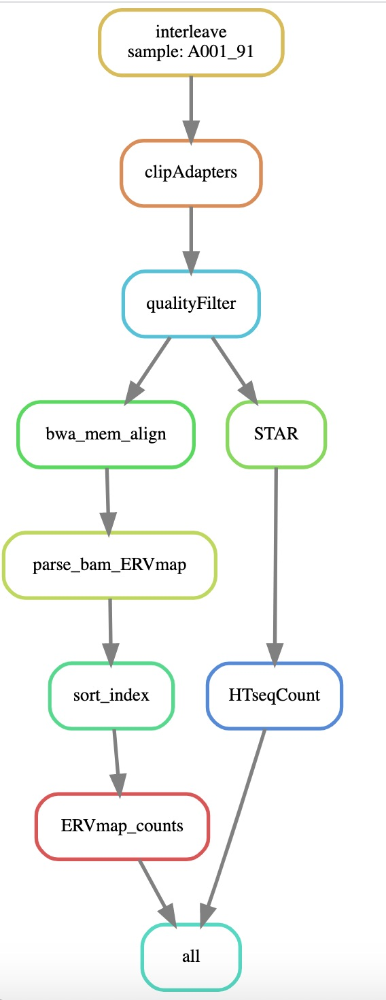

# RNASeqHERV
RNAseq pipeline to quantify genes and ERVs in RNAseq samples

<div align="center">
     
</div>


# Description
This pipeline aims to recreate the differential expression analysis described in Jones et al (2021) https://www.nature.com/articles/s41598-021-93742-3.pdf

# Steps

1.Interleave fastqs <br>
2.Trim adapters  <br>
3.Quality Control  <br>
4.BWA MEM align  <br>
5.Parse the alignments using adapted ERVmap scripts  <br>
6.Quantify ERV transcripts <br>
7.STAR align (output of Step 3)  <br>
8.HTseq count - quantify gene transcripts   <br>

# Dependencies
Conda environment is specified for each step and no tools need to be installed.

## Reference files

Reference genomes and indices for STAR and for bwa need to be set up and specified in the config.yaml file <br>
HERV locations annotation file also needs to be specified in the config.yaml
<br>I CAN PROVIDE THESE 

# Execution

Provided that the targets are specified in rule all, run the pipeline with:

```
nohup snakemake --use-conda --cores <HOWEVER_MANY_SAMPLES> --cluster "sbatch -p PARTITION_NAME --mem-per-cpu=35G" 
```

## Example of targets requested in rule 'all'
 ```
rule all:
    input:
        expand(outPath + "counts/{sample}.cntfile", sample=config["SAMPLES"]), 
        expand(outPath  + "htseq/{sample}.htseq.cnt", sample=config["SAMPLES"])
  ```
  This will produce counts for ERVs (.cntfile) and counts for cellular data (.htseq.cnt) for each sample
  
  Samples and the subfolders for each sample are defined in config.yaml. 
  
  # After running the pipeline - merge counts for ERVs and for cellular
  
  Step1: <br>
  copy to one directory using python script, remove with sed these extra few lines in the cellular counts files. CHANGE THE PATHS TO REFLECT YOUR OWN OR SIMPLY COPY THAT IN UNIX: <br>
  
  ```
import glob
import re
import os

os.system("mkdir -p output/erv")
os.system("mkdir -p output/cellular")

for file in /mnt/lustre/groups/projectmine/RNAseqRunningDir/output/cellular/*.htseq.cnt; do sed -i '/__/d' $file; done

for filepath in glob.iglob('/mnt/lustre/groups/projectmine/RNAseqRun*hg18/htseq/*/*.htseq.cnt'):
      os.system("cp %s output/cellular/" %(filepath))

for filepath in glob.iglob('/mnt/lustre/groups/projectmine/RNAseqRun*hg18/counts/*/*.cntfile'):
      os.system("cp %s output/erv/" %(filepath))
```
 
 Step2: <br>
 Go to directory cellular. If the file has two endings, remove the last one.  E.g. my files are A158_14_S29.htseq.cnt, etc, before the merge script get rid of the last ending: .cnt
 
 ```
 cd output/cellular
 for file in *.cnt; do     mv "$file" "${file%%.cnt}"; done
 ```
 
  Step2:<br>
  Merge using ERVmap scripts <br>
  ```
  perl scripts/merge.pl 3 6 cntfile ./output/erv > ./output/erv/merged_erv.txt
  perl scripts/merge.pl 0 1 htseq.cnt ./output/cellular > ./output/cellular/merged_cellular.txt
```
# Normalize from file - according to the instructions provided at https://github.com/mtokuyama/ERVmap

```
perl scripts/normalize_deseq.r  ./output/cellular/merged_cellular.txt ./output/cellular/normalized_cellular.txt ./output/cellular/normalized_factors.txt
perl scripts/normalize_with_file.pl ./output/cellular/normalized_factors.txt ./output/erv/merged_erv.txt > ./output/normalized_erv_counts.txt
```
